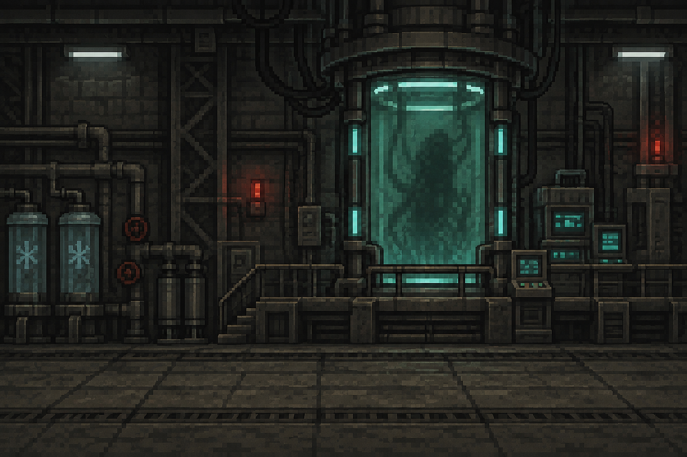
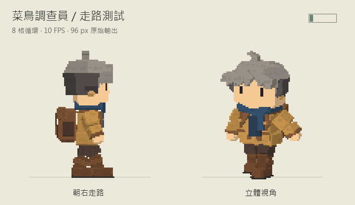

<p align="center">
  
</p>

<h1 align="center">菜鳥調查隊日誌</h1>

<p align="center">
  <strong>一場從村莊失聯開始的像素風調查冒險。</strong><br>
  閱讀線索、做出選擇，在命運與異常之間，留下自己的調查紀錄。
</p>

<p align="center">
  <a href="#快速開始"></a>
  <a href="#開發指南"></a>
  <a href="#下載與安裝"></a>
  <a href="https://github.com/hPPPf7/GameProject/actions/workflows/android-apk.yml"></a>
</p>

<p align="center">
  <a href="#遊戲介紹">遊戲介紹</a> ·
  <a href="#場景預覽">場景預覽</a> ·
  <a href="#下載與安裝">下載遊戲</a> ·
  <a href="#快速開始">快速開始</a> ·
  <a href="#開發指南">開發指南</a> ·
  <a href="https://github.com/hPPPf7/GameProject/issues">回報問題</a>
</p>

## 遊戲介紹

前哨站東北方的淺川村突然失聯，偵查傀儡只回傳錯碼。你是一名第一次被派上外勤的新人調查員，帶著錄製器與簡報資料，踏上前往村莊的路。

從荒野裡發熱的石頭，到村民的異常反應、研究據點的舊日投影，每次選擇都會改變調查的方向。你要查清村莊發生了什麼，也要面對那些逐漸指向自己的線索。

### 遊戲特色

- **分支劇情與命運值**：選項影響敘事語氣、道具、章節進度與三種結局。
- **調查紀錄與背包**：保留事件、選擇與回報，隨時翻閱紀錄或查看道具線索。
- **回合式戰鬥事件**：接近、揮劍、後跳復位，搭配命中停頓、受擊與震動回饋。
- **場景互動**：拾石微光、草叢電火花、門禁燈、進門動作、拍照與眨眼動畫。
- **像素風直式介面**：逐字文字、可捲動日誌、按鈕質感與等比例視窗縮放。
- **可調整的聲音與顯示**：音樂、音效、打字音量分開設定，畫面震動亦可關閉。

目前遊戲使用 **2D 角色動畫**，以 Python 與 Pygame 製作，提供 Windows 與 Android 建置流程。

## 場景預覽

<table align="center">
  <tr>
    <td align="center"></td>
    <td align="center"></td>
  </tr>
  <tr>
    <td align="center"><strong>淺川村</strong><br>調查村莊留下的異常線索</td>
    <td align="center"><strong>研究所</strong><br>深入核心，追尋被隱藏的紀錄</td>
  </tr>
</table>

<p align="center"><sub>以上為遊戲使用的背景美術；實際遊戲另有角色、文字日誌、選項與背包介面。</sub></p>

## 下載與安裝

| 平台 | 下載入口 | 安裝方式 |
| --- | --- | --- |
| Windows | [GitHub Releases](https://github.com/hPPPf7/GameProject/releases) | 在版本頁的 Assets 下載執行檔或壓縮檔，解壓縮後執行遊戲。 |
| Android | [Google Play](https://play.google.com/store/apps/details?id=tw.yuhan.InvestigationDiary) | 前往商店頁面安裝。 |
| 原始碼 | [快速開始](#快速開始) | 安裝 Python 與 Pygame 後，在專案根目錄啟動。 |

Windows 打包版使用執行檔旁的 `userdata/` 儲存進度與設定；更新版本時可保留該資料夾。

## 快速開始

需要 **Python 3.10 以上版本**。以下以 Windows PowerShell 為例：

```powershell
git clone https://github.com/hPPPf7/GameProject.git
cd GameProject
python -m venv .venv
.\.venv\Scripts\Activate.ps1
python -m pip install --upgrade pip
python -m pip install pygame
python main.py
```

如果已經有本機專案，直接在現有專案根目錄建立或啟用虛擬環境即可。

### 操作方式

| 操作 | 說明 |
| --- | --- |
| 點擊／觸碰選項 | 選擇行動；逐字播放尚未結束時，先顯示完整文字。 |
| 點擊「前進」 | 前往下一個事件；研究所開門後會顯示「進入研究所」。 |
| 捲動日誌 | 使用滾輪、捲軸或觸控滑動；「回到最新」可返回最新紀錄。 |
| 點擊背包物品 | 查看名稱、來源與用途說明，不消耗物品。 |
| 開啟設定 | 調整音樂、音效、打字音量與畫面震動。 |
| 拖曳視窗邊緣 | Windows 版依直式比例放大或縮小。 |

<details>
<summary>視窗縮放與像素清晰度</summary>

Windows 內容區維持 **512 × 847** 的比例，可拖曳四邊或四角縮放，最小約為原始大小的 60%。拖曳期間保留完整畫面並暫停文字與動作；最大化時等比置中，保留必要留白。其他桌面後端在尺寸事件後調整比例，Android 使用全螢幕。

視窗輸出使用最近鄰縮放，每次由原始遊戲畫面產生，不會因反覆縮放累積模糊。原始大小與整數倍放大最能維持像素格；非整數比例仍可能出現筆畫粗細不均，縮得很小也無法保留所有細節。

</details>

### 存檔與設定

| 執行方式 | 資料位置 |
| --- | --- |
| Windows 打包版 | 執行檔旁的 `userdata/` |
| 開發模式 | `%LOCALAPPDATA%\GameProject` |
| 未提供 `LOCALAPPDATA` 的環境 | 使用者家目錄下的 `GameProject` |

遊戲使用單一存檔，不持續建立上一份備份。已有存檔時，「開始新冒險」會先確認是否取代；讀檔不會覆蓋目前的逐字播放偏好。

## 開發指南

### 專案結構

```text
GameProject/
├── main.py                    # 遊戲入口與主迴圈
├── event_manager.py           # 事件條件、劇情分支與文字變體
├── event_result_handler.py    # 套用選項結果
├── battle_system.py           # 戰鬥流程
├── player_animation.py        # 角色動畫與場景移動
├── ui_manager.py              # 介面與場景繪製
├── ui_effects.py              # 拍照、眨眼與介面回饋
├── scene_details.py           # 拾石、電火花與門禁細節
├── window_resize.py           # 桌面視窗等比例縮放
├── save_manager.py            # 存檔管理
├── settings_manager.py        # 設定管理
├── sprite_sheet_inspector.py  # 動畫檢查工具
├── data/                      # 劇情資料
├── assets/                    # 背景、角色、字型與音訊
├── art/                       # 素材製作腳本與 Blender 試作
├── docs/                      # 角色動畫製作指引
└── tests/                     # 單元測試與遊戲流程驗證
```

### 劇情與素材

| 內容 | 位置 |
| --- | --- |
| 事件、選項與結局 | [data/story_data.json](data/story_data.json) |
| 目前的 2D 走路／攻擊圖 | [assets/sprite_sheet/](assets/sprite_sheet/) |
| 編號背景 | [assets/background_ascii/](assets/background_ascii/) |
| 研究所室內背景 | [assets/background/](assets/background/) |
| 音樂與音效 | [assets/sounds/](assets/sounds/) |
| 生圖提示詞與動畫驗收 | [角色動畫製作指引](docs/character_animation_prompts.md) |

背景支援描述性檔名，共用場景只需一份圖片。更新劇情或素材後，請以 `python main.py` 確認資源路徑、文字顯示與音效載入。

<details>
<summary>事件條件、研究所流程與舊存檔接續（含劇情細節）</summary>

- 第三章依序為門外守衛、開門、會議殘影與樣本日誌，再前往核心。村莊與報告線索影響入口描述，童謠額外解鎖哼唱；缺少線索仍能刷證或退後觀察再進入。
- 所有入場方法都設定 `visited_outpost`。第四章先完成接受／反制核心的選擇，其餘室內事件與終章自問才會開放；強制事件也必須符合章節及條件。
- 理性、正常、荒謬結局的命運值範圍分別為 **0～33、34～66、67～100**。開場接續 `accepted_id`／`refused_id`，九個最後選項各有不同收尾；「回家／留下」另加尾聲。正常結局的警告與破綻屬於敘事，沒有跨局繼承機制。
- 理性結局留在研究所，透過耳麥回報。守衛戰顯示實際的勝利、繞行或負傷脫離文字，銜接尚未開啟的大門。
- 舊存檔若已進入室內，接續時補齊入場紀錄；第四章缺少核心身分選擇時補上事件。第五章缺少身分紀錄時，使用不假定先前操作的開場。
- 尚未選擇的修訂事件會更新選項與當前描述；已開始播放的結局保留原段落及進度。

事件條件支援 `flag_any`；`text_conditions` 依序匹配狀態，優先於命運語氣；`ending_epilogues` 只附加第一個符合條件的尾聲。需要同步更新舊存檔中的未選事件時，請提高事件的 `revision`。

相關驗證：[劇情推進測試](tests/test_story_progression.py)、[實際結局與讀檔流程](tests/story_flow_scenario.py)。

</details>

<details>
<summary>場景互動與介面效果</summary>

| 場景／互動 | 呈現方式 |
| --- | --- |
| 荒野拾石 | 地面石頭與暖色微光約每 2.8 秒明暗一次，拾取後消失，讀檔沿用拾取狀態。 |
| 靜電草原 | 四處草叢錯開出現局部電火花，每次約 0.32 秒，不消耗劇情亂數。 |
| 研究所入口 | 開門後門禁轉綠、門縫透光；角色走向門檻並縮至 72%，再淡入室內。 |
| 拍照上傳 | 約 0.25 秒曝光，搭配快門聲、取景角標、照片縮圖與上傳箭頭，整段約 1.25 秒。 |
| 跟著一起眨眼 | 上方場景以像素眼簾閉合、睜開兩次，整段約 1.1 秒。 |
| 戰鬥 | 命中停頓、受擊閃白、敵人淡出與可調震動；角色落地後才開始敵方行動。 |
| 閱讀與操作 | 逐字音效、按鈕點選聲、取得道具提示與日誌捲軸。 |

拍照與眨眼只在選項成立時觸發，可在選項結果指定 `scene_action: "photo"` 或 `scene_action: "blink"`。效果僅限上方場景；略過打字、讀檔不重播，設定或失焦時暫停。

進門途中讀檔會回到已開門的入口；戰鬥動作途中存檔保留行動前的完整狀態，避免只記下一半結果。切出應用程式時，文字、動畫與全部音訊會暫停。

室內使用 `research_corridor.png`、`research_archive.png`、`research_core.png` 與 `bg031.png`；舊室內背景編號也會對應新圖。簡易室內圖與快門聲可分別由 [場景製作腳本](art/procedural/build_research_rooms.py)、[快門製作腳本](art/procedural/build_camera_shutter.py) 重製。

</details>

### 角色動畫與檢查工具

| 動作 | 圖片 | 播放設定 |
| --- | --- | --- |
| 走路 | `player_walk.png` | 3 欄 × 2 排、6 格、18 FPS |
| 攻擊 | `player_attack.png` | 9 個姿勢、12 FPS，播放順序 `1, 2, 3, 5, 4, 6, 7, 8, 9` |

在專案根目錄開啟檢查工具：

```powershell
.\inspect_sprites.ps1
.\inspect_sprites.ps1 assets\sprite_sheet\player_attack.png
```

也可執行 `python sprite_sheet_inspector.py`。工具使用 Pygame 與 Python 標準庫 Tkinter，不啟動遊戲或讀寫遊戲存檔。

<details>
<summary>播放、切圖與校正方式</summary>

- 支援播放／暫停、逐格查看、FPS、縮放、透明棋盤格、前格疊影、中心線與腳底線。
- 「連續動作」循環預覽待機、接近、攻擊與後跳；未儲存的走路／攻擊設定也會即時套用。
- 「並排比較」可比較平滑與清晰縮放，只影響工具；遊戲的角色取圖仍使用平滑縮放。
- 「切圖與校正」可調欄列、順序與 X/Y 偏移。格號從 1 起算，依每排左至右編號；重複格號可增加停留時間。
- 可拖曳各格取圖框的位置與大小，先「套用到預覽」再「儲存動畫設定」。移動取圖起點會同步補償偏移，維持共同畫布中的站位。
- 只有「儲存動畫設定」會寫入圖片旁的 `.animation.json`，不修改原圖；重新啟動遊戲後套用。預覽背景、縮放與橫向移動速度不影響遊戲。
- 快捷鍵：`Space` 播放／暫停、`←`／`→` 逐格、`Ctrl+O` 開啟、`Ctrl+S` 儲存。

**走路圖**為 1536 × 1024，每格 512 × 512，已校正頭部水平中心與腳底。探索與接近速度由步頻和距離計算，目前約每秒 360 遊戲像素。新圖片應維持朝右側面、透明背景、相同比例與落地高度。

**攻擊圖**為 1254 × 1254；腳底與劍會跨越等分格線，因此使用 `frame_rects` 的九個獨立取圖範圍、512 × 400 的共同畫布與逐格偏移。角色在遊戲中縮至 96 像素高，劍尖按敵人可見輪廓計算接近距離；第 5 張來源圖出現時，觸發一次音效與攻擊結果。攻擊後以末格姿勢後跳復位，約 0.22～0.38 秒、最高約 14 像素。

「套用分格」會先確認，再清除獨立取圖範圍、順序與偏移，恢復等分取圖。更換原圖後應重新校正；舊版 `assets/images/player/walk/`、`assets/images/player/attack/` 僅保留參考。

</details>

<details>
<summary>保留的 3D 試作與 GIF（目前遊戲未啟用）</summary>

遊戲固定使用 2D；3D 切換按鈕與 F3 切換已停用，即使舊設定記錄 `character_style: "3d"` 也不會載入。模型、骨架、動畫與載入能力仍保留，供後續調整；執行遊戲不需要 Blender。

<p align="center">
  
</p>

<p align="center"><sub>封存的 Blender 走路試作，非目前遊戲畫面。</sub></p>

| 動作 | 排列 | 格數 | 速度 |
| --- | --- | --- | --- |
| `idle.png` | 4 欄 × 2 排 | 8 | 6 FPS |
| `walk.png` | 4 欄 × 2 排 | 8 | 10 FPS |
| `attack.png` | 5 欄 × 3 排 | 15 | 15 FPS |

圖片位於 [assets/characters/rookie_3d/](assets/characters/rookie_3d/)，每格 128 × 96；原始模型與輸出腳本見 [Blender 試作說明](art/blender/rookie_pixel/README.md)。對應的 `.animation.json` 可用檢查工具預覽，不會套入目前遊戲。

</details>

<details>
<summary>待更新的美術素材</summary>

後續研究所室內場景以 `research_core.png` 為美術參考。結局圖片只保留正常結局 `bg034.png` 的方案；理性 `bg036.png` 與荒謬 `bg035.png` 列為待重製，不作為新圖參考，待新圖完成後再替換。

新角色動畫請先建立朝右側面基準圖，再生成走路循環。提示詞與驗收步驟見 [角色動畫製作指引](docs/character_animation_prompts.md)。

</details>

## 建置與測試

### Windows 執行檔

在已安裝 Pygame 的虛擬環境中執行：

```powershell
python -m pip install pyinstaller
python build_game.py
```

輸出為 `dist/InvestigationDiary.exe`，會打包 `assets/` 與 `data/`。

<details>
<summary>另一個建置入口：build.ps1</summary>

專案亦保留 `.\build.ps1`，使用 `.venv` 打包並輸出 `dist/main.exe`。這個腳本會先清除開發資料目錄中的 `save.json` 與 `settings.json`；需要保留本機進度時，請使用上方的 `python build_game.py`。

</details>

### Android APK

在具備 Buildozer 建置依賴的 Linux／WSL 環境執行：

```bash
buildozer android debug
```

可參考 [buildozer.spec](buildozer.spec)、[build_android.sh](build_android.sh) 與 [Android APK 工作流程](.github/workflows/android-apk.yml)。工作流程會上傳 `investigation-diary-debug-apk`，本機 APK 輸出位於 `bin/`。

| 設定 | 值 |
| --- | --- |
| Package | `org.gameproject.investigationdiary` |
| Android API／最低 API | 35／23 |
| 架構 | `arm64-v8a` |
| 主要依賴 | Python 3.10.12、Pygame |

### 自動化測試

```powershell
python -B -m unittest discover -s tests -v
```

測試涵蓋劇情順序、結局與舊存檔接續、戰鬥、角色動畫、介面回饋、音量、捲軸與視窗縮放。實際遊戲流程測試使用隔離的暫存存檔。

## 常見問題

<details>
<summary>啟動時找不到圖片、字型或音效</summary>

請確認從專案根目錄執行 `python main.py`，且 `assets/` 與 `data/` 完整保留。

</details>

<details>
<summary>打包後找不到資料檔</summary>

請使用 `python build_game.py`，它會將 `assets/` 與 `data/` 一起封裝；執行遊戲時不需另外啟動 Blender。

</details>

<details>
<summary>遊戲發生未處理錯誤</summary>

未處理例外會寫入 `crash.log`。開發模式可查看 `%LOCALAPPDATA%\GameProject\crash.log`；Windows 打包版則位於執行檔旁的 `userdata/`。

</details>

## 問題回報

歡迎透過 [GitHub Issues](https://github.com/hPPPf7/GameProject/issues) 回報問題。請附上作業系統、執行方式、重現步驟，以及相關的錯誤紀錄或畫面，方便確認發生原因。
