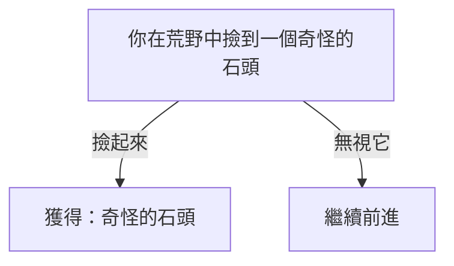
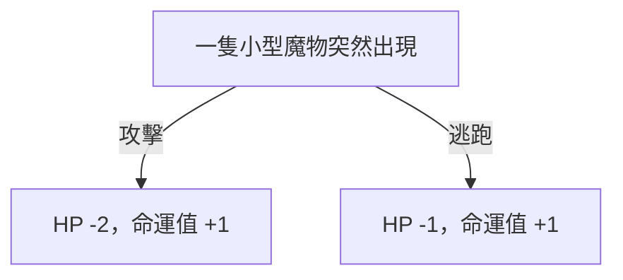
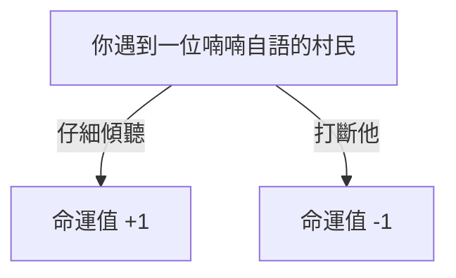
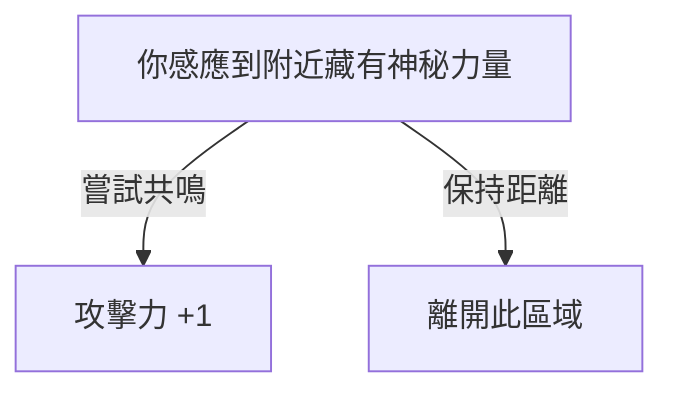

# 劇情事件

以下展示一組 **事件設計範例**，透過 Mermaid 繪製成簡易流程圖，方便在網站中檢視。實際遊戲事件可參考 `data/story_data.json` 進行擴充。

## 普通事件

```mermaid
graph TD
    A[你在荒野中撿到一個奇怪的石頭] -->|撿起來| B[獲得：奇怪的石頭]
    A -->|無視它| C[繼續前進]
```

## 戰鬥事件

```mermaid
graph TD
    D[一隻小型魔物突然出現] -->|攻擊| E[HP -2，命運值 +1]
    D -->|逃跑| F[HP -1，命運值 +1]
```

## 對話事件

```mermaid
graph TD
    G[你遇到一位喃喃自語的村民] -->|仔細傾聽| H[命運值 +1]
    G -->|打斷他| I[命運值 -1]
```

## 條件事件（命運值需求：2）

```mermaid
graph TD
    J[你感應到附近藏有神秘力量] -->|嘗試共鳴| K[攻擊力 +1]
    J -->|保持距離| L[離開此區域]
```
