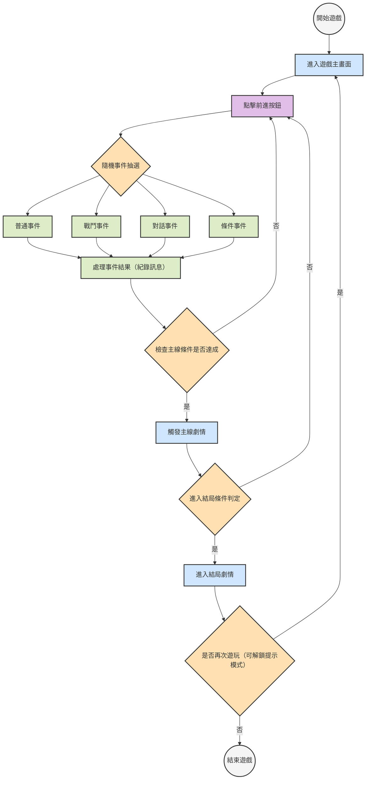

# 遊戲流程圖

此流程圖以 Mermaid 繪製，描繪遊戲從起點(開始遊戲)到結局(結束遊戲)的主要循環與判定。

## 流程圖符號說明

- **startEnd**（灰色圓形）：起點與結束
- **mainNode**（藍色方框）：主流程或主線劇情
- **action**（淺綠方框）：一般操作或事件處理
- **decision**（黃色菱形）：條件判斷或流程分支
- **button**（淡紫方框）：玩家互動按鈕（例如「點擊前進按鈕」）

以上顏色與形狀對應於圖中的 `classDef` 設定，可協助快速辨識各節點類型。
