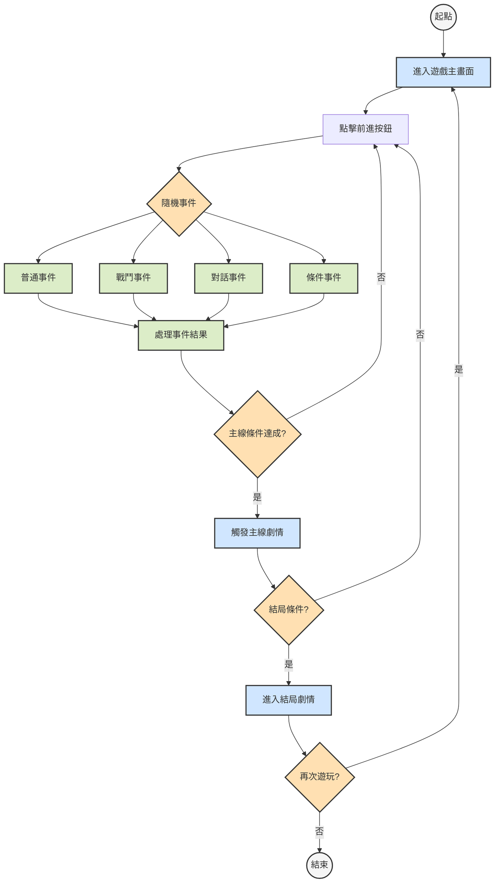

# 遊戲流程圖

```mermaid
graph TD
    classDef startEnd fill:#f5f5f5,stroke:#333,stroke-width:2px;
    classDef mainNode fill:#d0e6ff,stroke:#333,stroke-width:2px;
    classDef decision fill:#ffe0b2,stroke:#333,stroke-width:2px;
    classDef action fill:#dcedc8,stroke:#333,stroke-width:2px;

    S((起點)) --> M[進入遊戲主畫面]
    M --> Click[點擊前進按鈕]
    Click --> EvDraw{隨機事件}
    EvDraw --> EvNormal[普通事件]
    EvDraw --> EvBattle[戰鬥事件]
    EvDraw --> EvDialogue[對話事件]
    EvDraw --> EvCond[條件事件]
    EvNormal --> Process[處理事件結果]
    EvBattle --> Process
    EvDialogue --> Process
    EvCond --> Process
    Process --> StoryCheck{主線條件達成?}
    StoryCheck -- 否 --> Click
    StoryCheck -- 是 --> Mainline[觸發主線劇情]
    Mainline --> EndingCheck{結局條件?}
    EndingCheck -- 否 --> Click
    EndingCheck -- 是 --> Ending[進入結局劇情]
    Ending --> ReplayCheck{再次遊玩?}
    ReplayCheck -- 是 --> M
    ReplayCheck -- 否 --> E((結束))

    class S,E startEnd
    class M,Mainline,Ending mainNode
    class EvDraw,StoryCheck,EndingCheck,ReplayCheck decision
    class EvNormal,EvBattle,EvDialogue,EvCond,Process action
```

此流程圖以 Mermaid 繪製，描繪遊戲從起點到結局的主要循環與判定。
