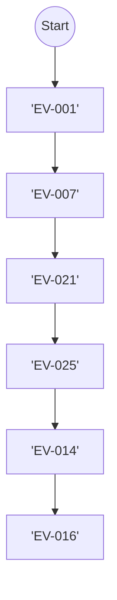

# 劇情流程

```mermaid
graph TD
    start((Start)) --> E1['EV-001']
    E1['EV-001'] --> E2['EV-007']
    E2['EV-007'] --> E3['EV-021']
    E3['EV-021'] --> E4['EV-025']
    E4['EV-025'] --> E5['EV-014']
    E5['EV-014'] --> E6['EV-016']
```

此圖可依 `data\story_data.json` 進行擴充。
